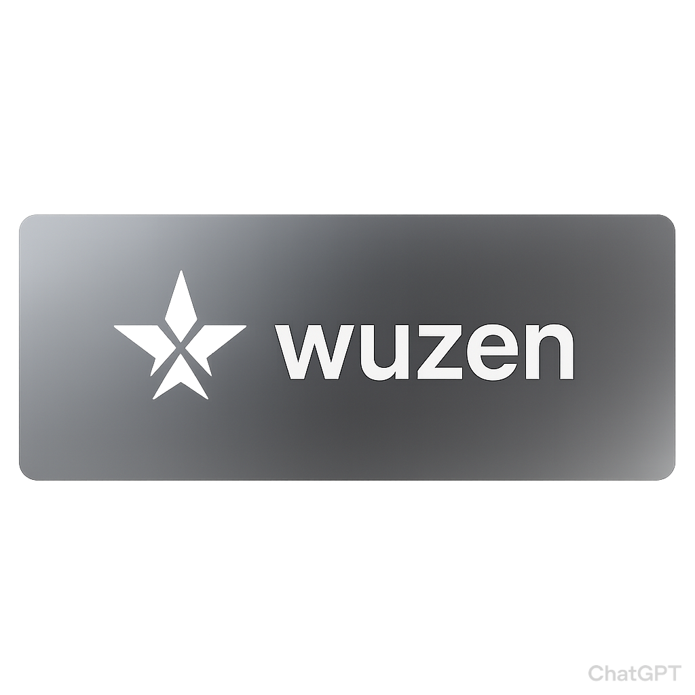

<!-- WUZEN README.md -->

  

  

  <em>“If you can see it… it’s already too late.”</em>

  
  
  

---

## 🧠 INTRODUCTION

*When firewalls sleep, Wuzen hunts.*  
Some tools *scan for weaknesses*. Wuzen creates them.  
It doesn’t knock — it’s already inside, wearing your admin badge, sipping coffee, and taking notes. 😈  

Wuzen is an elite-grade, stealth-control platform engineered for those who demand *total dominance* over target systems. With a control panel so sharp it could cut glass, Wuzen doesn’t just *monitor* — it owns.

---

## ⚙ FEATURES

Each feature includes space for demo screenshots/videos so you can showcase its full potential.  

---

### 📩 Read SMS  
Retrieve incoming and stored text messages.  
[Insert demo image/video here]  

---

### ✉ Send SMS  
Send messages manually or programmatically.  
[Insert demo image/video here]  

---

### 📇 Send SMS to Contacts List  
Blast messages to all saved contacts in seconds.  
[Insert demo image/video here]  

---

### 📞 Read Call Logs  
Access complete call history including timestamps.  
[Insert demo image/video here]  

---

### 📒 Read Contacts List  
Extract the full contacts database.  
[Insert demo image/video here]  

---

### 📩 Receive Incoming SMS  
Real-time inbound SMS capture.  
[Insert demo image/video here]  

---

### 📶 SIM Card Info  
Get SIM serial, carrier, and phone number.  
[Insert demo image/video here]  

---

### 💻 System Info  
Device model, OS version, hardware data.  
[Insert demo image/video here]  

---

### 📋 Installed Apps List  
Full inventory of installed applications.  
[Insert demo image/video here]  

---

### 📍 User Location (Background)  
Stealth GPS tracking without alerts.  
[Insert demo image/video here]  

---

### 📸 Capture Camera  
- Front Camera  
- Back Camera  
[Insert demo image/video here]  

---

### 🔔 Notifications Log  
- Email details  
- Chats & socials (Instagram, WhatsApp, Messenger, Reddit) with images  
- Hide notifications from the user  
[Insert demo image/video here]  

---

### 🎯 Keylogger  
- Logs every keystroke  
- Screen logger for secure apps  
[Insert demo image/video here]  

---

### 👁 Hidden VNC (HVNC)  
- Real-time hidden control  
- Skeleton view to bypass secure apps  
[Insert demo image/video here]  

---

### 🔐 Authenticator Stealers  
- Google Authenticator  
- Microsoft Authenticator  
[Insert demo image/video here]  

---

### 📢 Notification Sender  
- Custom icons  
- Open links/apps remotely  
[Insert demo image/video here]  

---

### 🚀 Launcher  
- Launch apps from background  
- Open links silently  
[Insert demo image/video here]  

---

### 🪙 Crypto Stealers  
- Binance login stealer  
- Trust Wallet PIN stealer  
[Insert demo image/video here]  

---

### 🔄 Clipboard Crypto Swap  
Supports BTC, ETH, XMR, XML, DOGE, SOL, DASH, ADA, TRX, TON.  
[Insert demo image/video here]  

---

### 📊 Control Panel  
- Device toggles (Keylogger, SMS, Notifications, etc.)  
- Telegram bot integration  
- Separate configurations per device  
[Insert demo image/video here]  

---

### 🛡 Identity Theft Tools  
- Fake KYC pop-ups for credential harvesting  
[Insert demo image/video here]  

---

## 💰 PRICING

| Version       | Price | Duration | Features |
|---------------|-------|----------|----------|
| Wuzen Elite | $48  | 1 Week   | Limited Features |
| Wuzen Pro   | $148 | 1 Week   | Full Feature Access |
💵 Payment Methods: *Crypto Only* (BTC, ETH, USDT, XMR)  
📩 Contact for Purchase: Telegram / WeChat  

---

## ⚠ DISCLAIMER

Wuzen is a powerful educational tool intended strictly for authorized security testing and research.  
The creator is not responsible for any misuse, damage, or illegal activity performed with this software.

---
